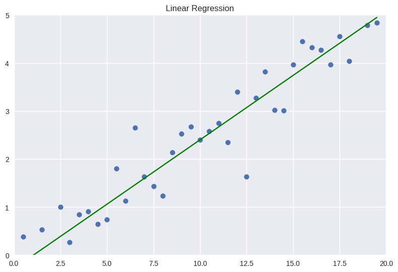

# Example Gambax Project
This example demonstrates how to simply use Gambax to define a **custom service** and a **custom model**.
We implement a custom model that uses the `OpenAI` API to make function calls and a service that given a set of points linearly regresses to the best fitting line to the data.
<div style="text-align: center;">
    
</div>

## 🚀 Usage
#### Define the Service and start the Server
```shell
python server.py
```

#### Launch the Client to make the Request
```shell
python client.py
```

## 💎 Model
```python
class CustomModel(ModelInterface):
    def __init__(self):
        super().__init__("custom_model")
        self.client = openai.OpenAI()

    
    def call_impl(self, messages: Dict[str,str], **kwargs):
        response = self.client.chat.completions.create(
            model="gpt-4o-mini",
            messages=messages,
            temperature=0.6,
            max_tokens=10000,
            top_p=1.0,
            **kwargs
        )
        if hasattr(response.choices[0].message, "function_call") and response.choices[0].message.function_call is not None:
            return {
                "function": response.choices[0].message.function_call.name,
                "arguments": response.choices[0].message.function_call.arguments
            }
        if hasattr(response.choices[0].message, "tool_calls") and response.choices[0].message.tool_calls is not None:
            return {
                "function": response.choices[0].message.tool_calls[0].function.name,
                "arguments": response.choices[0].message.tool_calls[0].function.arguments,
            }
        response_message = response.choices[0].message.content
        return response_message

```

## 🔧 Service
```python
class CustomService(Service):
    def __init__(self):
        super().__init__("custom_service", input_signature=["x", "y"], output_signature=["m", "b"])

    
    def request_impl(self, x: List[float], y: List[float]) -> str:
        # Generate x values
        x = np.array(x).squeeze()
        y = np.array(y).squeeze()

        # Fit a line (linear regression)
        coefficients = np.polyfit(x, y, 1)
        slope, intercept = coefficients

        return slope, intercept
    
    def get_tool(self):
        return {
            "type": "function",
            "function": {
                "name": "custom_service",
                "description": "Given a set of points, compute the slope and intercept through linear regression.",
                "parameters": {
                    "type": "object",
                    "properties": {
                        "x": {
                            "type": "array",
                            "description": "1D array containing x values of the points.",
                            "items": {
                                "type": "array",
                                "items": {
                                "type": "number"
                            }
                        }
                        },
                        "y": {
                            "type": "array",
                            "description": "1D array containing y values of the points.",
                            "items": {
                                "type": "array",
                                "items": {
                                "type": "number"
                            }
                        }
                        },
                    },
                    "required": ["x", "y"]
                }
            }
        }
```